# text2LabelSignLangRecog

## Key Frame Extraction(Videos and Corresponding Images)
The key frames are extracted based on the hand's bounding box, key points, confidence of bounding boxes or key points, motion, and image blurriness.

---
---

## Part 1 (The key points are detected by MediaPipe in this part.)

### Video 1
**Video (click the image below to download the video):**  
[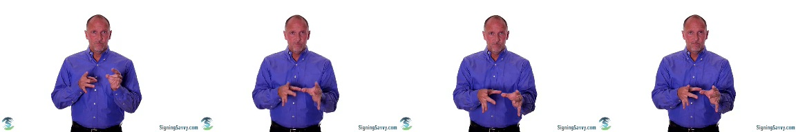](test_video/04430.mp4)

**Extracted Image:**  

---

### Video 2
**Video (click the image below to download the video):**  
[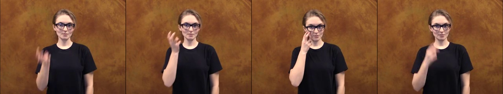](test_video/06650.mp4)

**Extracted Image:**  

---

### Video 3
**Video (click the image below to download the video):**  

**Extracted Image:**  

---

### Video 4
**Video (click the image below to download the video):**  
[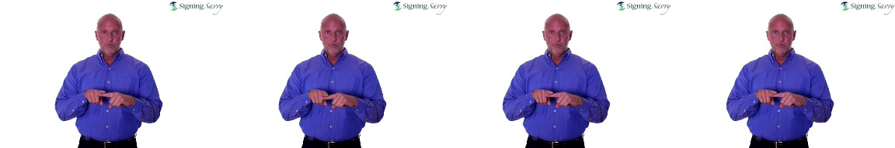](test_video/15606.mp4)

**Extracted Image:**  

---

### Video 5
**Video (click the image below to download the video):**  
[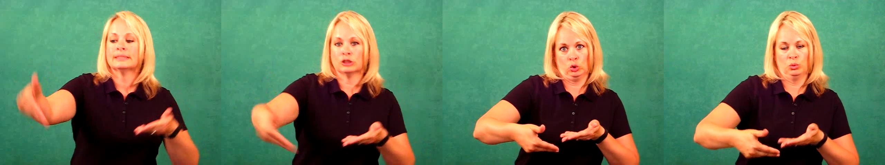](test_video/30385.mp4)

**Extracted Image:**  

---

### Video 6
**Video (click the image below to download the video):**  

**Extracted Image:**  

---

### Video 7
**Video (click the image below to download the video):**  

**Extracted Image:**  

---

### Video 8
**Video (click the image below to download the video):**  

**Extracted Image:**  

---

### Video 9
**Video (click the image below to download the video):**  
[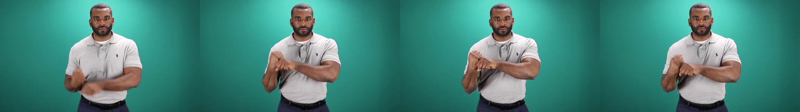](test_video/65140.mp4)

**Extracted Image:**  

---

### Video 10
**Video (click the image below to download the video):**  
[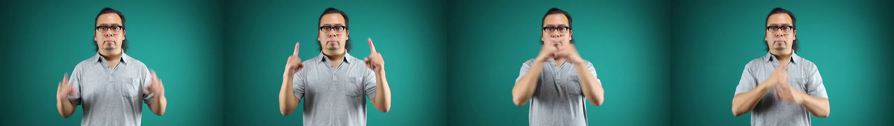](test_video/65388.mp4)

**Extracted Image:**  

---
---

## Part 2 (The key points are detected by OpenPose in this part.)

### Video 2
**Video (click the image below to download the video):**  
[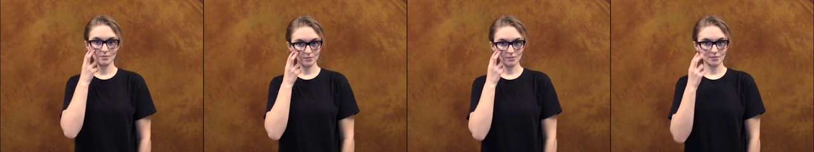](test_video/06650.mp4)

**Extracted Image:**  

---

### Video 4
**Video (click the image below to download the video):**  
[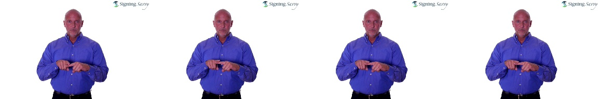](test_video/15606.mp4)

**Extracted Image:**  

---

### Video 5
**Video (click the image below to download the video):**  
[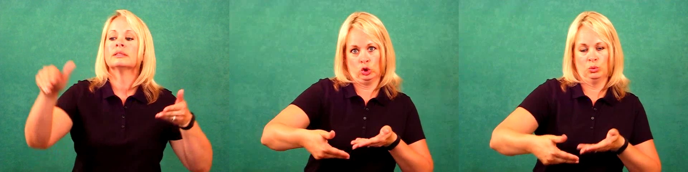](test_video/30385.mp4)

**Extracted Image:**  

---

### Video 9
**Video (click the image below to download the video):**  
[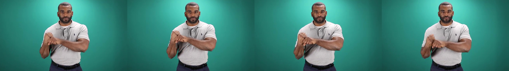](test_video/65140.mp4)

**Extracted Image:**  

---

### Video 10
**Video (click the image below to download the video):**  
[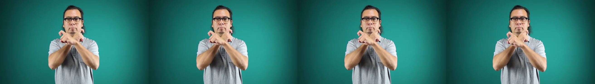](test_video/65388.mp4)

**Extracted Image:**  

---
---
## Summary

If we increase the threshold for key points confidence or the threshold for sharpness, both will filter out blury frames, resulting in a lack of dynamic motion.